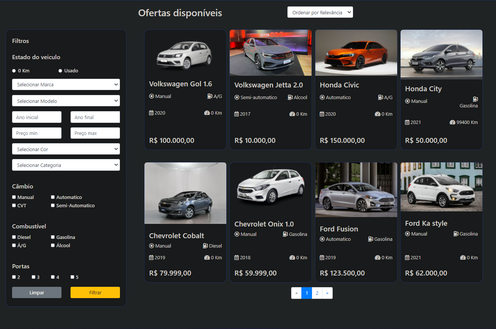

# README

<p align="center">
    <a href="#sobre">Sobre</a>
    <a href="#tecnologias">Tecnologias</a>
    <a href="#funcionalidades">Funcionalidades</a>
    <a href="#demonstracao">Demonstração</a>
    <a href="#instalacao">Instalação</a>
</p>

# Sobre
<p>Este projeto foi construído com o intuito de praticar a manipulação de parâmetros de uma API utilizando Django e Django Rest Framework para construção da API REST seguindo o padrão REST Full.<br>
Consiste em um ecommerce de carros onde é possível aplicar diversos filtros, seja por marca, modelo, categoria, ordenar por preço em ordem crescente ou decrescente, dentre outros.
</p>
<p>OBS: Este projeto não tem como intuito possuir uma interface totalmente estilizada/responsiva, mas sim possuir 1 backend bem construído.</p>
<br>

# Tecnologias
<p>O projeto foi construído utilizando as seguintes tecnologias para o backend:</p>
<ul>
    <li>Python</li>
    <li>Django</li>
    <li>Django Rest Framework</li>
</ul>
<p>O front-end foi construído com:</p>
<ul>
    <li>JavaScript</li>
    <li>HTML5</li>
    <li>CSS</li>
</ul>
<p>Já para o banco de dados, optei por utilizar:</p>
<ul>
    <li>MySQL</li>
</ul>
<p>
<p>Para a construção dos testes automatizados a escolha foi utilizar o:</p>
<ul>
    <li>PyTest</li>
</ul>
</p>
<p>E por fim, a documentação da API foi construída utilizando:</p>
<ul>
    <li>Swagger</li>
</ul>
</p>
<br>

# Funcionalidades
✔️ Listar os veiculos.<br>
✔️ Filtrar os veiculos.<br>
✔️ Paginação.<br>
✔️ Testes Automatizados da API.<br>
✔️ Documentação da API.<br>
<br>

# Demonstracao 
<h1 align="center">
    Estoque
    
    Documentação (Pode ser acessada pelo endpoint /doc)
    
</h1>


# Instalacao
Antes de começar, você vai precisar ter instalado em sua máquina as seguintes ferramentas:
[Git](https://gitscm.com), [Python](https://www.python.org/downloads/) e um servidor MySQL, recomendo o [MySQLWorkbench](https://dev.mysql.com/downloads/workbench/).
Além disso é bom ter um editor para trabalhar com o código como o [VSCode](https://code.visualstudio.com/download) ou o [PyCharm](https://www.jetbrains.com/pt-br/pycharm/download/) (Recomendado).

```bash
# Clone este repositório
$ git clone <https://github.com/welistonbelles/ecommerce-cars>

# Acesse a pasta do projeto no terminal/cmd
$ cd ecommerce-cars

# Instale as dependências
$ pip install -r requirements.txt
```
### 🔧 Configuracao
```python
# Conecte o arquivo ecommerce.sql com o seu banco de dados MySQL.

# Abra o arquivo config/settings.py e nesta parte configure de acordo com seu banco de dados
DATABASES = {
    'default': {
        'ENGINE': 'django.db.backends.mysql',
        'NAME': 'ecommerce',
        'USER': 'root',
        'PASSWORD': '',
        'HOST': 'localhost', # caso rode em localhost
        'PORT': '3306', # porta padrão
    }
}

# Após conectar com seu banco de dados, é hora de rodarmos as migrates.

# Aplique as migrations ao seu banco de dados
python manage.py migrate

# Com tudo configurado, basta rodarmos nossa aplicação:
python manage.py runserver
```